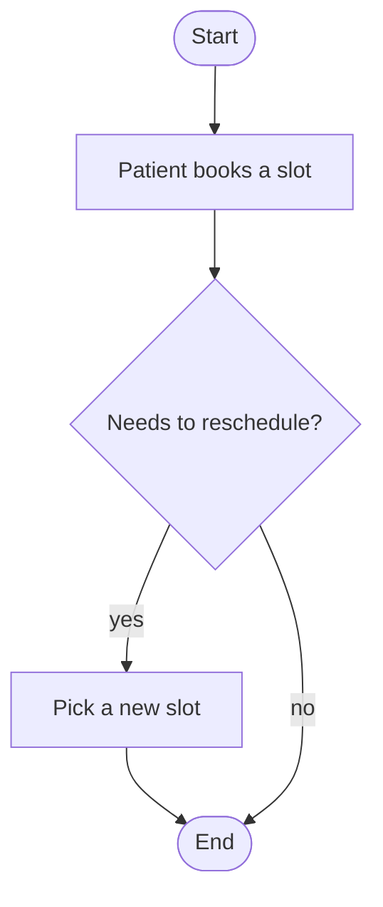

# Process mapping standard

Read before writing or updating `process.md`.

## File structure

```markdown
# <Initiative> — Process map

## Glossary

| Term | Definition |
|------|------------|

## As-is
<narrative, 3–6 sentences>

<mermaid diagram>

## To-be
<narrative>

<mermaid diagram>

## Pain points / gaps

| # | Pain | Affected step | Addressed by |
|---|------|---------------|--------------|
```

## Mermaid conventions

- Use `flowchart TD`. Start: `S([Start])`, end: `E([End])`.
- Node ids: `P1..Pn` for steps, `D1..Dn` for decisions; labels in the artifact language; quote labels containing punctuation.
- Decisions are diamonds (`D1{...}`) with labeled branches `-->|yes|`.
- Keep under ~15 nodes; split by actor with `subgraph <Actor name>` when several actors participate.
- Mark changed steps in the to-be diagram with a comment: `%% changed: US-003`.

## Syntax check

Before finishing, re-read each diagram: every referenced id is defined, every `-->` connects existing nodes, every `subgraph` block is closed with `end`.

## Example


