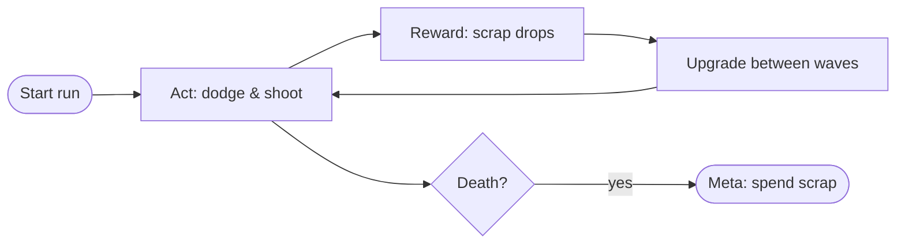

# GDD standard (gdd.md)

Read before writing or updating `gdd.md`.

## File structure

```markdown
# <Game title> — Game Design Document

> Version: 1 | Source: brief.md v1 | Status: draft

## 1. Pillars
<2–3 short statements. Every mechanic must serve one; a mechanic serving none is cut.>

## 2. Core loop
<one sentence, then mermaid>


## 3. Mechanics

| ID | Pillar | Mechanic | Fun because… | Testable behavior |
|----|--------|----------|--------------|-------------------|
| MECH-001 | Mastery | Dash with 1s cooldown | near-miss tension | dash distance 160px, i-frames 120ms, cooldown gate blocks input (see BAL-01..03) |

### MECH-001: Dash
- **Inputs:** Shift / double-tap direction.
- **Behavior:** …(observable, references BAL-xx rows, no inline numbers)
- **Edge cases:** dash into wall, dash during cooldown, dash while stunned.

## 4. Progression & failure
<what grows over a session/run/meta; what failure costs; restart loop>

## 5. Levels / content briefs

| ID | Concept | Introduced mechanic | Exit condition |
|----|---------|--------------------:|----------------|
| LVL-001 | First corridor teaches dash | MECH-001 | cross gap 3x |

## 6. UI requirements
<screens list: Boot/Menu/Game/GameOver/Settings; per screen — what info is visible when; input map. Wireframe in ASCII if helpful. Visual styling belongs to the asset registry, not here.>

## 7. Out of scope
<explicit Won't list — the scope fence>

## 8. Open questions
```

## Rules

- Mechanics table is the contract: SA derives FRs from MECH-xxx exactly like from US-xxx; QA derives test cases from "Testable behavior".
- Numbers always reference balance rows (`BAL-xx`) — never inline literals in two places.
- LVL briefs state *what the level teaches/introduces*, not tile-by-tile layouts (content comes after the loop is proven).
- Update `Version` on substantive change; SA pins it (`Source: gdd.md v2`).
- Keep it under ~4 pages: a GDD nobody rereads is dead weight.
