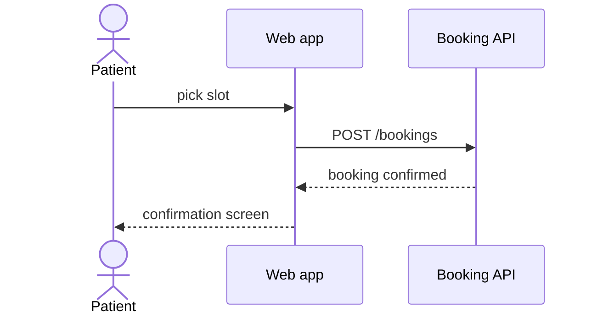

# Diagrams standard (diagrams.md)

## File structure

One file, one `##` section per diagram, ordered: C4 context → C4 containers → sequences → ER. Title each sequence with the story it implements (`## US-007: Checkout flow`).

## Mermaid conventions

- Node ids and technical names in English; labels in the artifact language.
- Model C4 levels with plain `flowchart` — C4-specific mermaid extensions render unreliably across wikis:
  - **Level 1 (context):** your system as one node, users and external systems around it.
  - **Level 2 (containers):** internal blocks (web app, API service, database, queue) with protocol labels on edges (`-->|HTTPS/JSON|`).
- Sequences: `sequenceDiagram`; participants named by component; one flow per diagram; a comment line `%% US-007 checkout flow` above each.
- ER: `erDiagram`; entity names singular English; attribute types generic (`string`, `int`, `datetime`, `uuid`).
- Keep every diagram under ~20 elements; split otherwise.

## Syntax check

Re-read each diagram before finishing: participants/ids are defined, every arrow connects existing names, every `subgraph`/`alt`/`loop` block is closed (`end`).

## Example fragment

